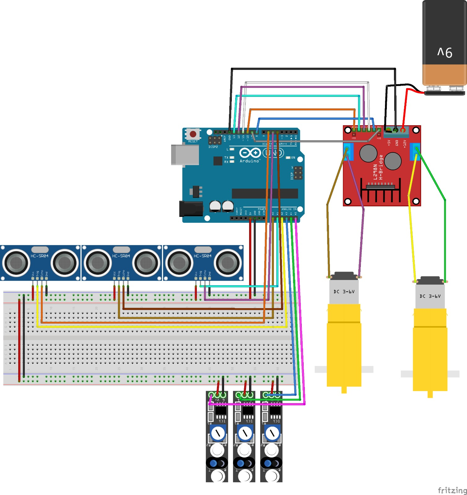

# Relatorio do Projeto

## Objetivos
O objetivo principal deste projeto foi o desenvolvimento e a implementação de um robô autônomo para a modalidade **Sumô de Robôs**, capaz de operar em uma arena circular respeitando as restrições de peso (1kg) e dimensões estabelecidas.

## Objetivos Específicos
1. Integrar sistemas de hardware e software utilizando arquitetura baseada em **HAL (Hardware Abstraction Layer)**.
2. Implementar lógica de controle via manipulação direta de registradores do microcontrolador **ATmega328P** para otimização de tempo de resposta.
3. Aplicar conhecimentos de eletrônica na substituição e adaptação de componentes do kit básico para superação de falhas de hardware.

## Fluxograma do Robô

## Componentes
#### O sistema do robô foi construído sobre um chassi impresso em 3D. Os componentes principais utilizados foram:

1. Processamento: 1x **Arduino Uno R3** (Microcontrolador ATmega328P).
2. 2x **Motores DC** com caixa de redução (amarelos).
3. 1x **Ponte H L298N** (substituída posteriormente).
4. 3x **Sensores Ultrassônicos HC-SR04** (posicionamento frontal e lateral).
5. 3x **Sensores Infravermelhos (IR) KY-033**.

## Programação

O projeto foi inteiramente escrito em C. O uso das funções de abstração do Arduino foi evitado. No lugar das funções **digitalWrite**, **analogWrite**, **digitalRead** e **pinMode**, optou-se pelo uso de registradores para extrair o máximo de desempenho do **Atmega328P** e economizar ciclos de máquina. Além disso, obstaram funções bloqueantes como o pulseIn, optando por interrupção de hardware para detectar mudanças no pino **ECHO** do **sensor ultrassônico HC SR04**. A mesma abordagem foi aplicada nos **sensores infravermelho KY-033**.

### Jusiticativa de uso dos Registradores
> [!NOTE]
> Fundamentação Técnica: Os registradores são regiões do silício dedicadas para armazenamento temporário, e funcionam internamente com arranjos de **flip-flops** para armazenar bits. Por estarem integrados diretamente na CPU e no topo da hierarquia de memória, custam apenas **1 ciclo de clock para serem acessados**, tornando a operação praticamente instantânea.

* Vantagens: Velocidade de execução superior (microssegundos vs milissegundos) e **controle granular do hardware**.
* Desvantagens: Redução da legibilidade do código e menor portabilidade entre diferentes microcontroladores.

### Arquitetura HAL e Modularidade

O código foi estruturado utilizando uma **HAL (Hardware Abstraction Layer)**. 

Esta camada isola a lógica de decisão (estratégia) das instruções de hardware (acionamento de pinos). Isso permitiu que a equipe alterasse a forma como os motores ou sensores eram lidos (por exemplo, trocando uma biblioteca por registradores) sem precisar reescrever a lógica de combate, o que garante alta modularidade no código e facilidade para manutenção. 

Com as interrupções de hardware devidamente ativadas, detectou-se alterações nos pinos dos sensores de forma não bloqueante, aliviando o processador e economizando ciclos.

## Montagem

### Esquema do circuito elétrico

## Estrátegia

#### A estratégia do robô é dividida em 3 prioridades:

| Prioridade | Condição | Estado | Descrição |
| :---: | :---: | :---: | :--- |
| **1** | Linha Branca | **FLEE** | Fuga imediata da borda |
| **2** | Avistar Inimigo | **ATTACK** | Ataque ativo |
| **3** | Oscioso | **SCAN** | Busca por rotação |

---

### Explicação dos Estados do Robô 

  #### Estado FLEE
  > [!NOTE]
  > É o estado de maior prioridade, acionado via interrupção ou **polling** de alta frequência dos sensores IR (PINC). Quando detectada a refletividade da linha branca (borda da arena), o robô interrompe imediatamente qualquer ação de ataque.

  * Comportamento: Giro rápido para redirecionar a frente do robô para o centro da arena
  * Verificações: O sistema verifica qual sensor (frontal ou traseiro) detectou a linha para otimizar a manobra de evasão.

  #### Estado ATACK
  > [!NOTE]
  > Acionado quando os sensores ultrassônicos identificam um objeto dentro do raio de combate **(<= 30cm)**.

  * Estratégia: O robô ignora a rotina de busca e aplica potência máxima nos motores na direção do alvo

  #### Estado SCAN
  > [!NOTE]
  > É o estado padrão quando não há ameaças ou alvos.
  
  * Comportamento: O robô **gira em torno do próprio eixo** (motores em sentidos opostos) para realizar uma varredura de 360º com os sensores ultrassônicos. Esta rotação é feita em velocidade controlada para garantir que os sensores tenham tempo hábil para processar o eco do sinal ultrassônico.

  
## Testes e Conclusões
  
  #### Playlist da equipe
  * [Projeto robô sumô V2](https://youtube.com/playlist?list=PLKnvuzxRsdl1yls-MqXq9lSY66JDN-sMj&si=i5gbV4IcVIsQtO6N)

  ### Dificuldades
  > [!IMPORTANT]
  Durante o desenvolvimento, a equipe enfrentou desafios significativos relacionados à **infraestrutura de hardware**:
  
  * Instabilidade de Conexões: Os jumpers e a protoboard do kit apresentaram **mau contato** intermitente que desligava o microcontrolador ou falseava leituras dos sensores.
  * Fornecimento de Energia: **Brown-out** (reinício) do Arduino devido as baterias originais não suportarem a corrente de pico dos motores. Foi necessário adaptar baterias de Li-Ion externas.
  * Qualidade dos Componentes: A **Ponte H** original apresentou defeito em um dos canais, exigindo substituição e atrasando a fase de testes integrados. Essa substituição aplica-se também aos **sensores ultrassônicos e jumpers**.
  ---
  ### Possiveis Melhorias
  
  Considerar substituição total da protoboard por uma **Placa de Circuito Impresso (PCI)** soldada, a fim de garantir robustez mecânica.

