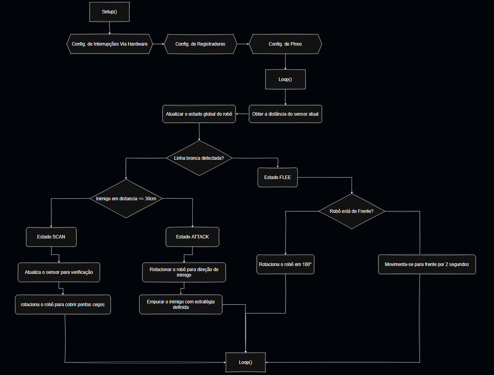

# Relatorio do Projeto

## Objetivos
Explorar o uso de Registradores para aproveitamento eficiente das capacidades do arduino (você pode complementar @dratsuni)

## Descrição 
https://www.tinkercad.com/things/jaid3eWrbSX-v2?sharecode=tanXYu2DRVrXd9FRoDCKiLnOYknDvmg-rGgqkKgtICE
### Fluxograma

## Componentes
1. componente
2. componente
3. componente
4. componente

### Justificativa de uso:

## Programação
### Jusiticativa de uso dos Registradores

apontar também a modularidade do codigo e o HAL

## Montagem

### Esquema do circuito elétrico

## Estrátegia

#### A estratégia do robô é dividida em 3 prioridades:

| Prioridade | Condição | Estado | Descrição |
| :---: | :---: | :---: | :--- |
| **1** | Linha Branca | **FLEE** | Verificação da linha branca e fuga |
| **2** | Avistar Inimigo | **ATTACK** | Detecção do inimigo e ataque ativo |
| **3** | Oscioso | **SCAN** | Procurar o inimigo na arena |

---

### Explicação dos Estados do Robô 

  #### Estado FLEE
  * coloco a explicao de como é a fuga e verificações internas extras
  #### Estado ATACK
  * como é o ataque (bem como as estrategias de ataque)
  #### Estado SCAN
  * como é o scaneamento
  
## Testes e Conclusões

  #### Playlist da equipe
  * https://youtube.com/playlist?list=PLKnvuzxRsdl1yls-MqXq9lSY66JDN-sMj&si=i5gbV4IcVIsQtO6N

  ### Dificuldades
  ### Possiveis Melhorias

